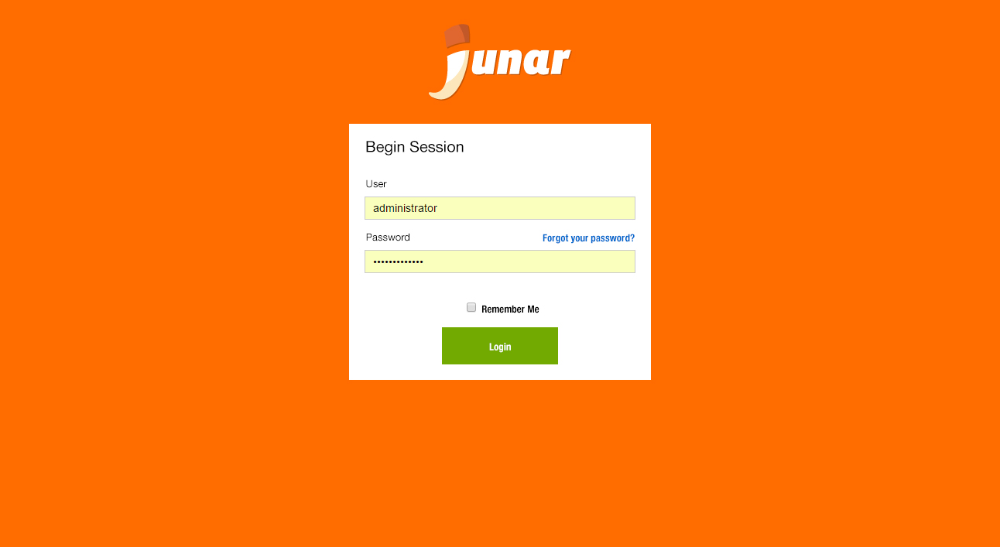

2. Accessing the Junar Platform
===============================

To access the Junar platform, the user must have a valid username and password. If you need to add a new user, please ask your account’s administrator or send a request to support@junar.com

2.1 User Roles
--------------

+ Editors: Users with the Editor role are able to create, edit, and send datasets, data views, and visualizations for revision. Editors are also able to delete resources, as long as the resources have not already been sent for revision.

+ Publishers: Users with the Publisher role have the same rights as Editors, but they can also publish, unpublish, and delete all resources.

+ Administrators: Users with the Administrator role have the same rights as Publishers, but they can also make modifications to the platform’s settings.

