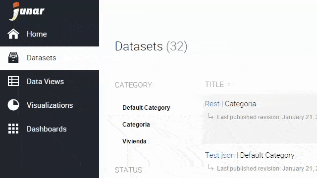
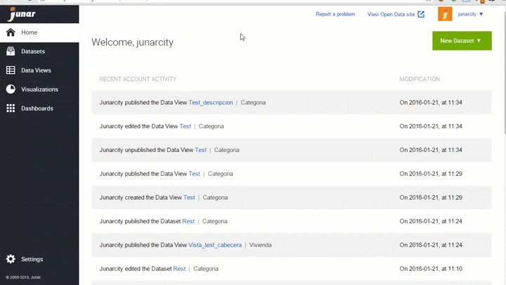
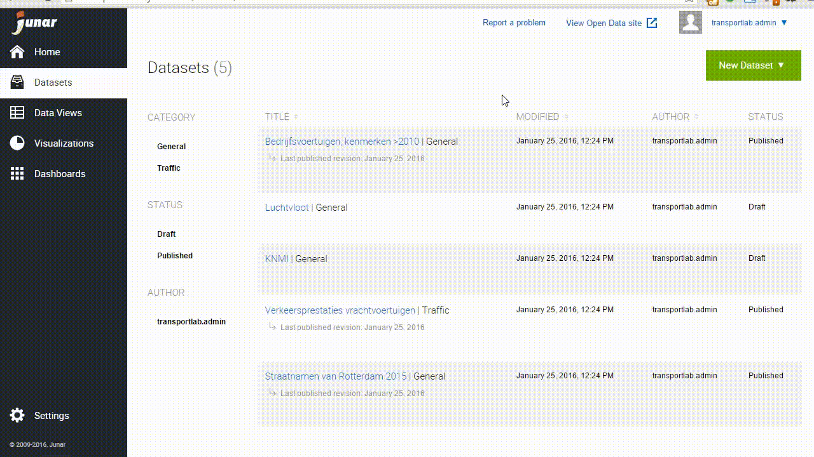
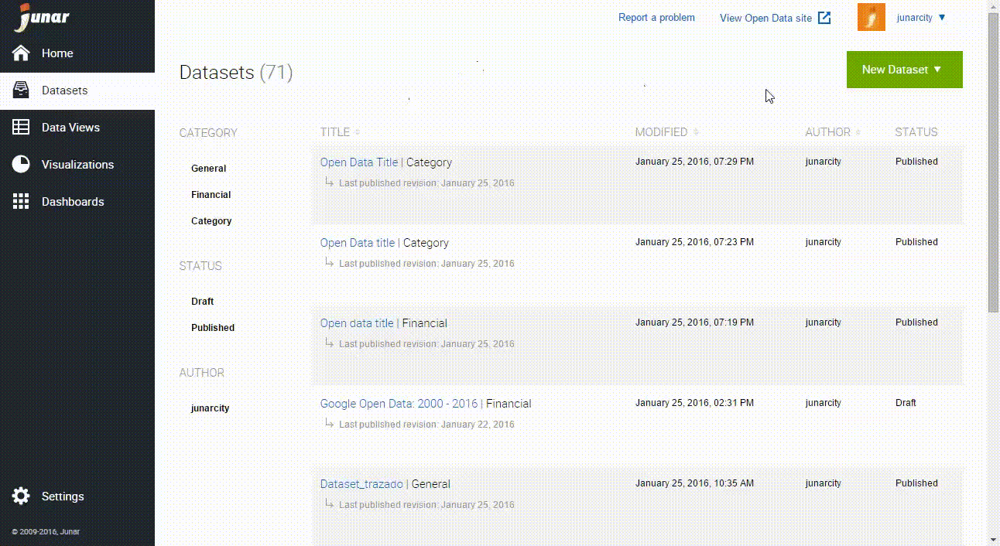
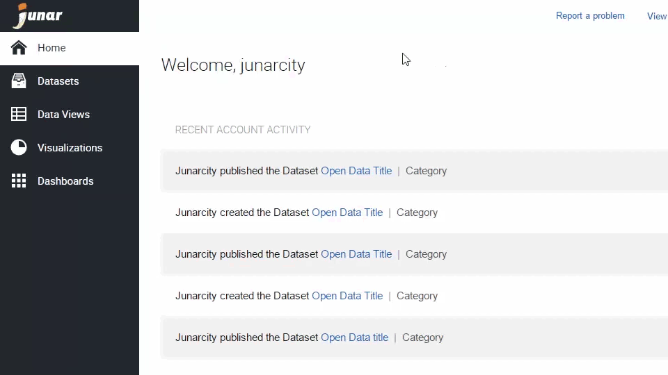
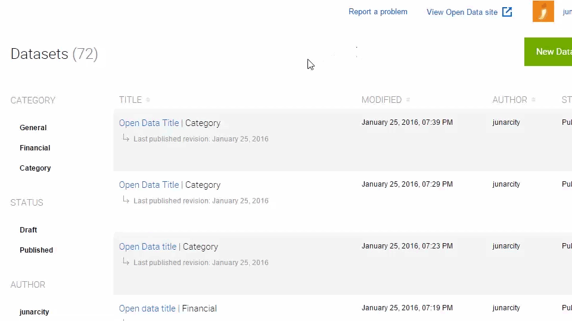
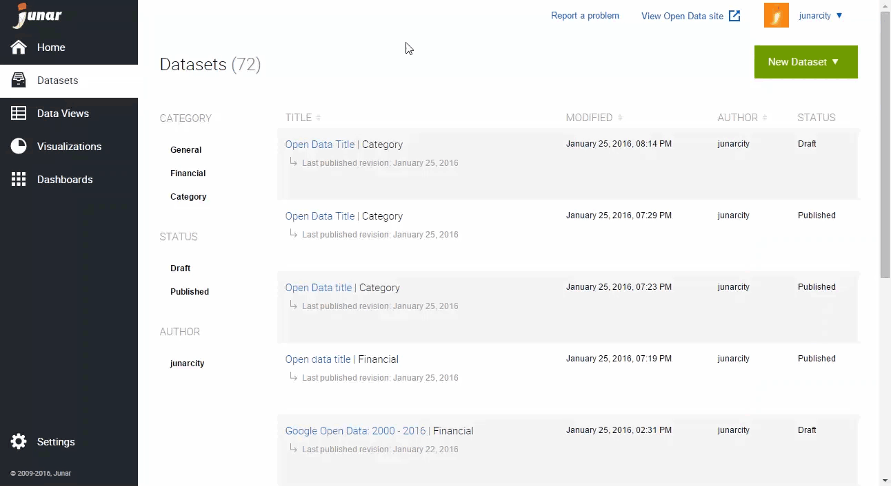
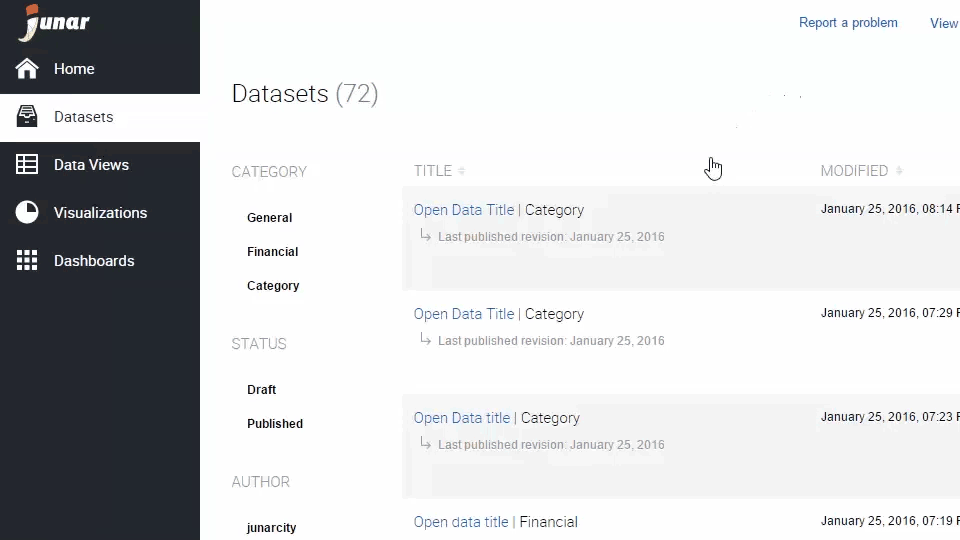

4. Creating a Dataset
=====================

On the main menu, place your mouse over Datasets, then from the dropdown, select New resource from one of the following: file, URL or web service.

Another option is to click on Datasets in the main menu, and then click on the New Dataset button in the upper right part of the screen.

4.1 Creating a Dataset from a File on your PC
---------------------------------------------

To select a file from your computer, click on Select. A pop up window will open, then choose a file on your computer that you would like to upload and click on Open. After filling out all the required fields, click on the Next button to fill out the new dataset’s Title, Description, Category, Resources, Tags, and Notes fields. Once done, click Save.

4.2 Creating a Dataset from a Website or Server
-----------------------------------------------

The Junar platform is also able to collect data from a website, webpage, or hosted file on a server to create datasets.

+ Website: Enter a valid URL of the website you want to collect the data from. Please note that Junar can import data on tables (<table></table>). After filling out all the required fields, click on the Next button to fill out the new dataset’s Title, Description, Category, Resources, Tags, and Notes fields. Once done, click Save.
  
  .. image:: ../_static/images/img04-04.gif

+ File hosted on a server: This option requires you to provide a valid URL address of a document in any of the formats supported by Junar (refer to Section 1.1 What is a Dataset?).

  .. image:: ../_static/images/img04-05.gif

4.3 Creating a Dataset from a Web Service
-----------------------------------------

The Junar platform can also collect data from a SOAP or REST web service.

+ Collecting data from a SOAP/XML web service: Please provide the Endpoint for your Soap web service. Then select SOAP/XML from the Web Service Type drop down. Finally, provide the following parameters that are also needed:

  + Method - provide a valid method name for your web service
  + Namespace - provide a valid namespace for your web service
  + Add others parameters - if needed to access the website

Note: these values are case sensitive.

+ Collecting data from a REST/JSON web service: Please provide the Endpoint for your REST/JSON web service. Then select REST/JSON from the Web Service Type drop down. Finally, provide the following parameters that are also needed:

  + Path to Data - defines the path (xpath or json-path) to table data

Similar to the SOAP/XML web services, you can obtain and collect data as a dataset from JSON objects.

After filling out all the required fields, click on the Next button to fill out the new dataset’s Title, Description, Category, Resources, Tags, and Notes fields. Once done, click Save.

4.4 Editing and Deleting Datasets
---------------------------------

To edit/delete a dataset, please go to the Datasets page by clicking on the Datasets button from the main menu on the left. Place your mouse over the dataset’s title in the list and the editing menu will be displayed. Click on Edit or Delete.

+ Create Data View: When selecting this option, the user is able to create a new data view using the selected dataset as the source.
+ Edit: When selecting this option, the user is able to update the dataset’s information.
+ Delete: When selecting this option, the user is able to delete the recent changes or all changes made to the dataset.
+ Download: When selecting this option, the user accesses the resource page or downloads the attached file from a dataset.

You may also click on the dataset’s title to go into its information section, then click on the options menu |icon-menu|  located on the upper right section of your screen. From the drop down menu, click on Edit or Delete.

The Junar platform allows you to eliminate the Current Revision or All Revisions of a dataset. This last action removes a dataset and all of its associated resources, thus it also removes them from the Open Data microsite. The term “revisions” means the various changes made to the information in the dataset.

4.5 Publishing a Dataset
------------------------

By default, all new datasets will be saved as drafts. To publish a dataset to the Open Data microsite, click on the dataset of interest and then the Publish button in the upper right section.

To access the published dataset on the Open Data microsite, click on the dataset you want to check on, then click on the View on Site button under the dataset’s title.

