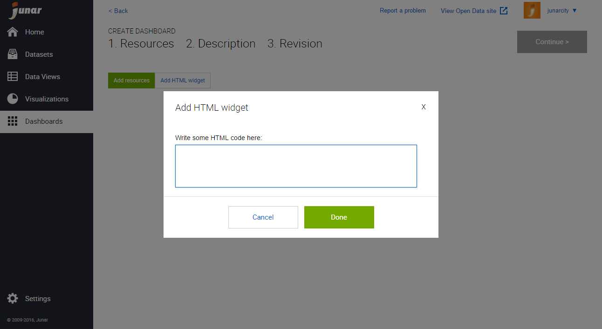
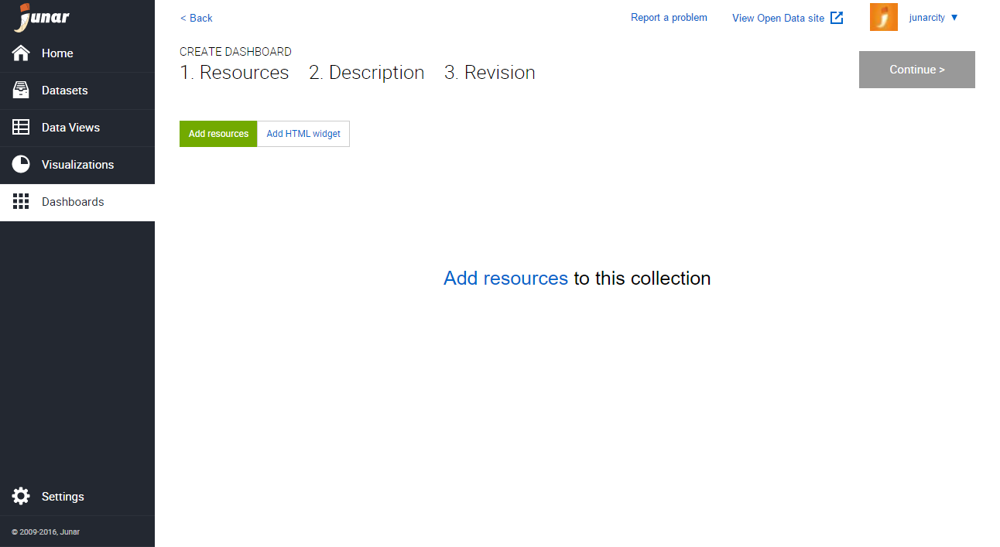
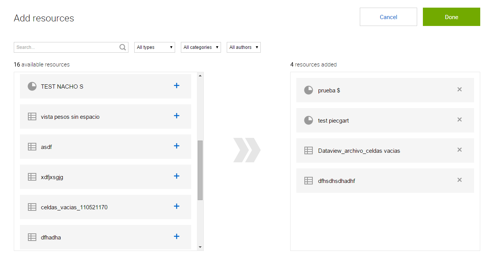

7. Creating a Dashboard
=======================

You can create a new dashboard by placing your mouse over the Dashboard button from the main menu and clicking on New. You can also create a new dashboard by clicking on the New Dashboard button in the Dashboard section.

[INSERT GIF HERE]

The platform will launch the wizard to add content to your new dashboard.

Click on HTML widget to launch the wizard, add HTML code, and be able to import external content such as embed codes, an iFrame, URLs, etc...

Click on Add resources to start adding resources on the platform.

In the Add resources wizard, click on the available resources on the left. You may use the search box and filters to find your resources quicker. When finished, click on Done.

Next, you can organize and resize your dashboards as needed by dragging the elements from the top and resizing them by dragging from the bottom right corner. (DOESN’T MAKE SENSE)

.. image:: ../_static/images/img07-05.png

Once you are done making changes to the new dashboard, click on Continue to add a Title, Description, and Other Metadata or select as a Feature dashboard. When finished, click on Continue for a final review. If you are happy with the result, click on Save. The new dashboard will be saved as a Draft, and you can now publish it to the Open Data microsite.

7.1 Editing and Deleting Dashboards
-----------------------------------

To edit/delete a dashboard, please go to the Dashboards page by clicking on the Dashboard button from the main menu on the left. Place your mouse over the dashboard’s title in the list and the editing menu will be displayed. Click on Edit or Delete.

[INSERT GIF HERE]

+ Edit: When selecting this option, the user is able to update the dashboard’s information.
+ Delete: When selecting this option, the user is able to delete the recent changes or all changes made to the dashboard.

You may also click on the dashboard’s title to go into its information section, then click on the options menu |icon-menu| located on the upper right part of your screen. From the drop down menu, click on Edit or Delete.

[INSERT GIF HERE].

7.2 Publishing a Dashboard
--------------------------

To publish a dashboard, the associated resources must be published. If the resources are under review, they must first be accepted to be published. To publish a dashboard to the Open Data microsite, click on the dashboard of interest and then the Publish button in the upper right section.

[INSERT GIF HERE]

.. |icon-menu| image:: ../_static/images/icon-menu.png
