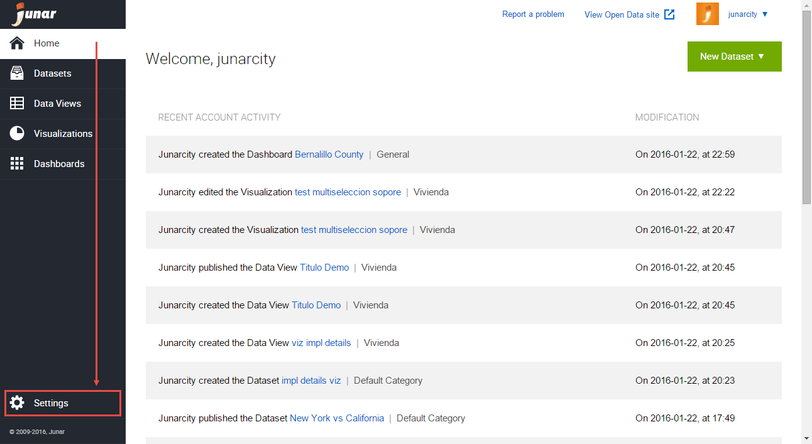
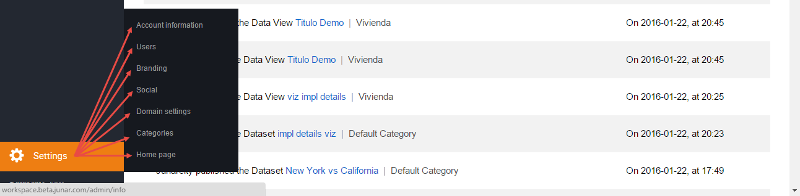

8. Account Configuration
========================

8.1 Settings
------------

To access the account settings and change your configuration, click on Settings located in the lower left part of the screen.

In this section, you will be able to change all Account information, add Users, manage Branding options, determine the Social settings, configure the Domain settings, add/remove Categories, and select/customize your Homepage’s (Open Data microsite) template.

+ Account Information: This tab contains your account information. Name of your organization and Website address are visible to all who visit the microsite. However, Contact Information (Email, Phone, and Country) is only available to Junar. After you complete the required fields (*), click the Save button.

  .. image:: ../_static/images/img08-03.png

+ Users: In this tab, you can modify and create users. Click on the Add New User button located on the upper left side of the screen. This action will allow you to add a new user to the account. Complete the following fields: Name, Username, E-mail, Confirmation E-mail, and Role, then press the Save button. An e-mail is automatically sent to the new user and will include a link to activate their password.

  .. image:: ../_static/images/img08-04.png

+ Branding: In this tab, you can customize the appearance of the site. This includes a 
Title, Header URL, Footer URL, Logo, and Favicon (icon of the website). You may also alter the Display (title, header, buttons and background colors).

  .. image:: ../_static/images/img08-05.png

+ Social: In this tab, you can enable/disable various options on the site such as Embed actions, Social sharing, Notes, and Downloads. (SHOULDN’T YOU EXPLAIN WHAT EACH ONE DOES? NOT SELF-EXPLANATORY)

  .. image:: ../_static/images/img08-06.png

+ Domain Settings: In this tab, you can configure your Open Data microsite’s URL. You may choose to use our free domain (http://client.opendata.junar.com) or your own. For more information on how to accomplish this please write to support@junar.com

  .. image:: ../_static/images/img08-07.png

+ Categories: In this tab, you can create/delete the platform’s Categories. It has an initial default category which can be modified by clicking on the Create category button. Fill out the name field, click on Set as default category, then the Save button.

  You can also edit and delete a category. In cases where resources are created with a deleted category, these resources will migrate to the category that has been determined by default.

  .. image:: ../_static/images/img08-08.png

+ Home Page: In this tab you can assign one of our templates to your Open Data microsite. Each template has a number map with information for each section of the template.

  .. image:: ../_static/images/img08-09.png

