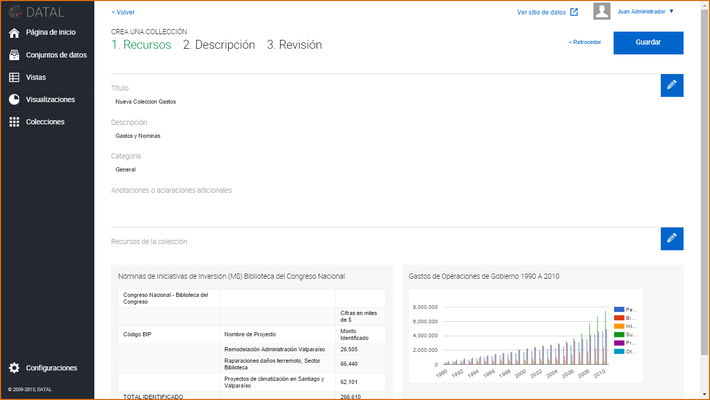
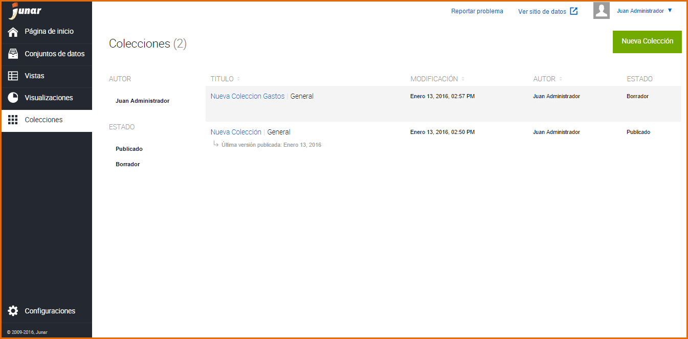
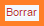

7. Creación de una Colección
============================
Acceso directo desde:

Posicionarse sobre el botón → Colecciones

Seleccione la opción → Nueva

Ingrese a la sección → Colecciones

.. image:: ../_static/images/img073.png
  :align: center

Presione el botón → Nueva Colección

.. image:: ../_static/images/img074.png

La plataforma muestra el listado de Recursos Disponibles y Recursos agregados permitiendo agregar recursos o bloques HTML a la Colección.

Para agregar Recursos a la Colección, presione el botón |icono-mas-2| permitiendo agregar recursos asociados, Vistas |icono-vista-2| y Visualizaciones |icono-visualizacion-2| .

Para agregar Recursos presiona el botón el botón |icono-mas-2| permitiendo agregar Vistas |icono-vista-2| y Visualizaciones |icono-visualizacion-2| .

Luego de agregar los recursos presiona el botón **Listo**

La plataforma muestra los recursos agregados. Puede modificar el orden en el que aparecen los recursos.

.. image:: ../_static/images/img076.png

Creada la colección, presione el botón **"Continuar"**.

El sistema muestra la siguiente pantalla, complete los campos requeridos (*), pudiendo omitirse el campo Notas. 

El sistema permite seleccionar las siguientes opciones:

+ Colección como destacada 
+ Mostrar colecciones relacionadas.

.. image:: ../_static/images/img077.png
  :align: center

Luego de completar los campos requeridos, presione el botón **"Continuar"** y luego el botón **"Guardar"**. La Colección se crea por defecto en estado **Borrador**.

7.1 Edición de una Colección
----------------------------
Antes de Guardar la Colección o sea antes de presionar el botón Guardar, puede editar la colección presionando el botón |icono-editar-2|, esta acción le permite seleccionar nuevamente los recursos agregados. También puede editar la información de la Colección presionado el |icono-editar-2| ubicado el margen derecho de la pantalla.

Una vez creada la Colección, se muestra la misma en un listado, este listado cuenta con una paginación, es decir que se puede ir avanzando página por página dentro del listado. Para esto se dirige a la sección → Colecciones 

Para editar una Colección, hay dos opciones:

+ Clic sobre la Colección: El sistema muestra los recursos agregados en la pestaña “Recursos” y en la pestaña “Descripción” la información del mismo: Título del gráfico, Estado, Fecha de Creación, Descripción, Categoría y Nota, presione |icono-editar| , e introduzca los cambios sobre la información como así también sobre el contenido de la Colección.

  .. image:: ../_static/images/img082.png

+ Acercar el mouse sobre la Colección: Se muestra las siguientes opciones:

  .. image:: ../_static/images/img083.png
    :align: center

  + Editar: Al hacer click sobre este botón puede realizar cambios a la información de la Colección.
  + Borrar: Al hacer click sobre este botón puede borrar los cambios recientes de la Colección o todos los cambios de la Colección.

Cuando la Colección se encuentra en **Revisión**:  

+ Los usuarios con el rol de Editor pueden enviar la Colección a Revisión, la Colección en este estado no puede ser editada, su opción de Editar solo es posible cuando el recurso es **Aceptado** o **Rechazado**.

+ Los usuarios con el rol de Publicador o Administrador podrán **Aceptar** o **Rechazar** el recurso para luego publicarlo.

  .. image:: ../_static/images/img084.png

7.2 Publicación de una Colección
--------------------------------

Para publicar una Colección, la Visualización, la Vista y el Conjunto de Datos asociados deben estar previamente Publicados. En el caso que la Colección esté en **Revisión**, esta deberá ser **Aceptada** para posteriormente ser **Publicada**, haga click sobre el botón **Publicar**.

.. image:: ../_static/images/img085.png

Para acceder al micrositio y ver la Visualización publicada |icono-visualizacion-publicada| , haga clic sobre |icono-ver-sitio| , en el margen superior derecho.

7.3 Eliminación de una Colección
--------------------------------   
Para eliminar una Visualización, hay dos opciones:

+ Dentro de la Colección, clic sobre |icono-eliminar|
+ En el listado de Colecciones, seleccione una Visualización y presione el Botón |btn-borrar| 

.. image:: ../_static/images/img087.png
  :align: center

Si la Visualización se encuentra con estado en **Revisión**, no podrá ser eliminada de la plataforma.

.. |icono-mas-2| image:: ../_static/images/icono-mas-2.png

.. |icono-editar-2| image:: ../_static/images/icono-editar-2.png
.. |icono-editar| image:: ../_static/images/icono-editar.png

.. |icono-ver-sitio| image:: ../_static/images/icono-ver-sitio.png
.. |icono-eliminar| image:: ../_static/images/icono-eliminar.png

