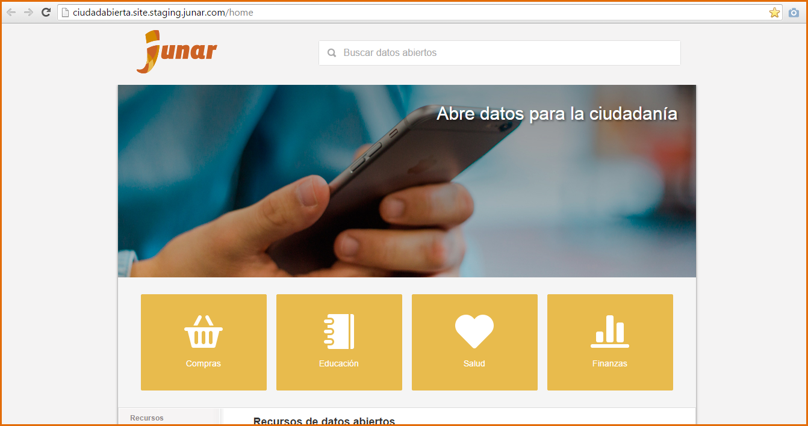
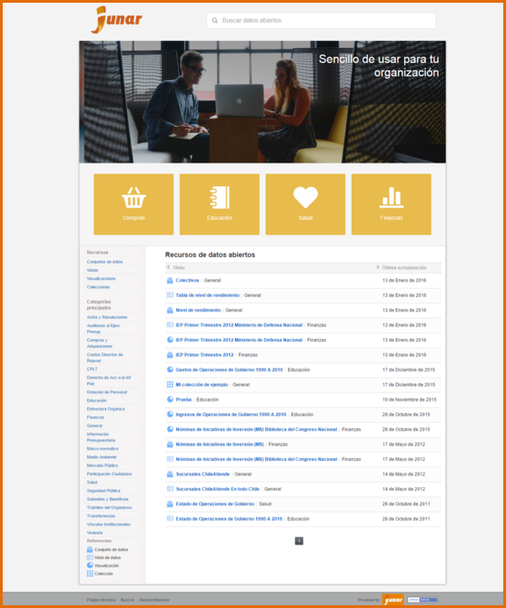
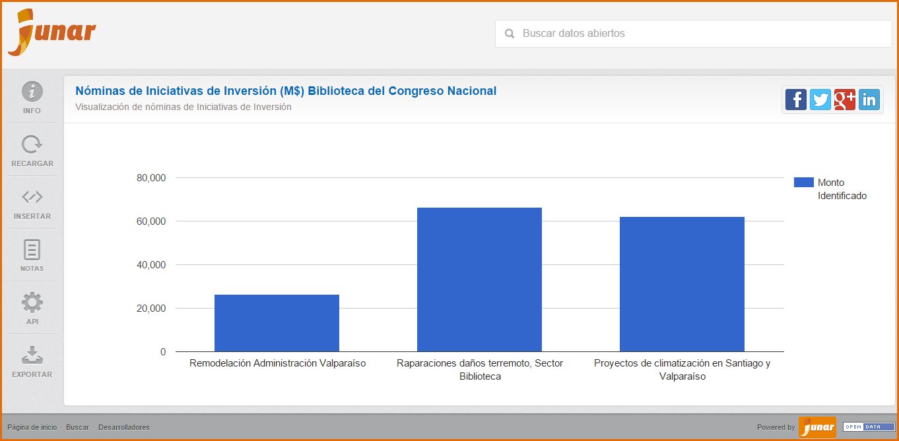
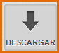
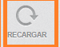
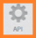

9. Micrositio o Sitio de Datos Abiertos
=======================================

Ingrese a la URL `http://microsites.dev:8080/home <http://microsites.dev:8080/home/>`_ 

El sitio muestra un icono de la página web, título de bienvenida, breve introducción de lo que trata el micrositio, catálogo de recursos publicados, filtro para la búsqueda de recursos, tipos recursos, categorías principales de los recursos y referencias.

Para acceder a los recursos del micrositio de datos abiertos, haga click sobre el recurso requerido.

Conjunto de Datos |icono-conjunto-datos|: El micrositio visualiza el Conjunto de Datos con sus recursos asociados (si los tiene) y un buscador de recursos. También la opción de Compartir es una posibilidad que da Junar para mostrar a otros los recursos de tu interés de una manera sencilla. Podrá compartir vía Twitter, Facebook, Google+ y LinkedIn |icono-social|.

En el margen izquierdo de la visualización del Conjunto de Datos se muestran los siguientes botones:

+ Para acceder a la información del Conjunto de Datos presione |icono-info|
+ Para descargar el archivo del Conjunto de Datos presione |icono-descargar|

  .. image:: ../_static/images/img099.png

Vista |icono-vista|: El micrositio de datos abiertos visualiza el contenido de la Vista, un buscador de recursos y permite compartir la Vista de manera sencilla a través de Twitter, Facebook, Google+, LinkedIn |icono-social|.

En el margen izquierdo de la visualización de la Vista se muestran los siguientes botones:

+ Para acceder a la información de la Vista presione |icono-info|
+ Para actualizar el contenido de la Vista presione |icono-recargar|
+ Para insertar la Vista presione |icono-insertar|
+ Para solicitar la Vista de datos a través de la API presione |icono-api|
+ Para exportar la Vista de datos en formato CSV, XLS/XLSx o usar Google Spreadsheet presione |icono-exportar|

  .. image:: ../_static/images/img100.png

Visualización |icono-visualizacion|: El micrositio de datos abiertos muestra la Visualización, un buscador de recursos y permite compartir la Visualización de manera sencilla a través de Twitter, Facebook, Google+, LinkedIn |icono-social|.

En el margen izquierdo de la Visualización se muestran los siguientes botones:

+ Para acceder a la información de la Visualización presione |icono-info|
+ Para actualizar el contenido de la vista presione |icono-recargar|
+ Para insertar la visualización presione |icono-insertar|
+ Para solicitar la Visualización a través de la API presione |icono-api|
+ Para exportar la Visualización en formato CSV o XLS/XLSx presione |icono-exportar|

.. |icono-conjunto-datos| image:: ../_static/images/icono-conjunto-datos.png

.. |icono-vista| image:: ../_static/images/icono-vista.png

.. |icono-visualizacion| image:: ../_static/images/icono-visualizacion.png
