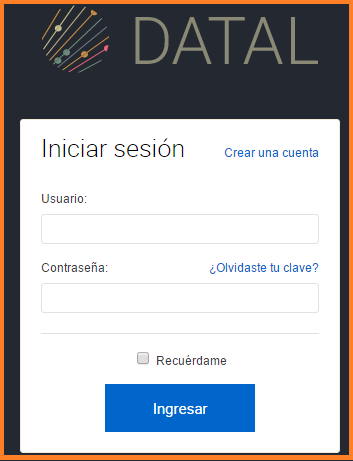

2. Accesibilidad
================

Para acceder a la aplicación los usuarios inician sesión a través de un usuario y contraseña, de esta manera accederán a la Plataforma Junar de Datos Abiertos.

2.1 Tipos de Usuarios
---------------------

+ Editor: Puede crear, editar y enviar a revisión un conjunto de datos, vistas y visualizaciones. Puede eliminar recursos, siempre y cuando no hayan sido enviados a revisión. En ese caso, solo el administrador puede eliminarlo.
+ Publicador: Tiene los mismos permisos del editor pero además puede publicar, despublicar y eliminar todos los recursos.
+ Administrador: Tiene los mismo permisos que el publicador pero además puede configurar la cuenta.