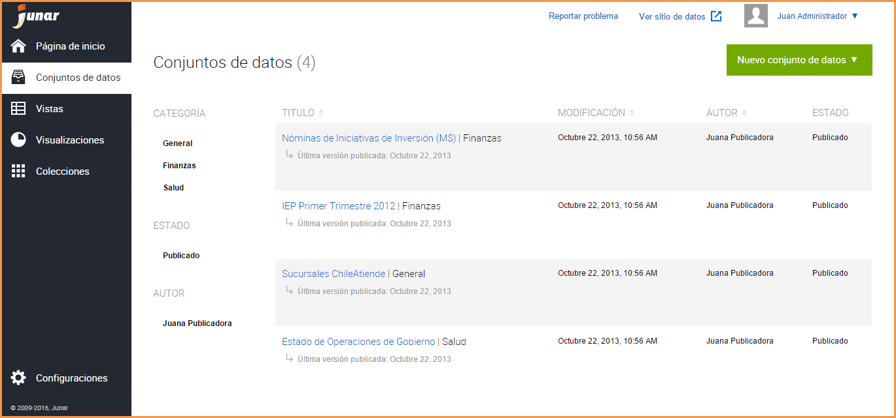
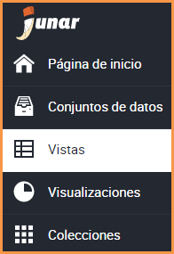
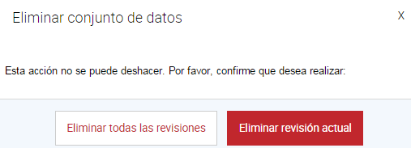

4. Creación de un Conjunto de Datos
===================================

Acceso directo desde:

Posicionarse sobre el botón Conjunto de datos

Seleccione una opción de recolección de datos

.. image:: ../_static/images/img004.png

Otra opción para poder acceder es:

Ingrese a la sección Conjuntos de Datos

.. image:: ../_static/images/img005.png
  :align: center

Presione el botón Nuevos Conjuntos de Datos

Seleccione una opción de recolección de datos

.. image:: ../_static/images/img006.png
  :align: center

4.1 Desde un Archivo
--------------------

.. image:: ../_static/images/img007.png
  :align: center

La Plataforma brinda la posibilidad de utilizar archivos recolectados desde su computador como Conjunto de Datos, cargarlos  a la plataforma y convertirlos en  recursos de datos abiertos. Seleccione el archivo desde su computador, haga click sobre “Seleccionar”, el sistema adjunta el archivo elegido. La recolección de datos consta de campos requeridos (*) que deben ser completados, pudiendo omitirse los otros. Luego de completar los campos requeridos, presione el botón Continuar.

4.2 Desde una URL o sitio web
-----------------------------

.. image:: ../_static/images/img008.png
  :align: center

También nuestra Plataforma permite recolectar datos desde un Sitio Web o Archivos hospedados en la red como Conjunto de Datos, cargarlos a la plataforma y convertirlos en  recursos de datos abiertos. 

+ Sitio Web: Ingrese una URL con un enlace válido a la página web desde donde se quiera recolectar. Luego de completar los campos requeridos, presione el botón Continuar.
+ Archivos hospedados en la red: Se sigue el mismo procedimiento anterior, sin embargo lo que cambia es la fuente de la información. Para esta opción se requiere copiar una dirección de enlace de algún documento en alguno de los formatos soportados por Junar. Para ver la lista completa, ver la sección: ¿Que es un Conjunto de Datos?

.. image:: ../_static/images/img009.png
  :align: center

4.3 Desde un Servicio Web
-------------------------

Nuestra Plataforma permite recolectar datos no solamente desde archivos locales, Sitio Web o Archivos Hospedados en la red, sino también a través de Servicios Web SOAP o REST, cargarlos  a nuestra plataforma y convertirlo en un recurso de datos abiertos. 

+ Servicios Web SOAP: Ingrese una URL desde donde se está obteniendo el Servicio Web. Determine el tipo de servicio web SOAP/XML, también se necesitan los siguientes parámetros:

  + Método: Nombre del método asociado al conjunto de datos que queremos obtener.
  + Espacio de Nombres: Provee un método para evitar conflictos de nombre entre recursos.
  + Agregar otros parámetros: Si es necesario para acceder al sitio web.

  Estos parámetros deben ingresarse respetando mayúsculas y minúsculas.

  Esta información suele encontrarse en el mismo sitio desde donde se desea obtener la información, como también puede consultarle al administrador del sistema que esté albergando los servicios web.

+ Servicios Web REST: Ingrese una URL desde donde se está obteniendo el Servicio Web. Determine el tipo de servicio web REST/JSON, también se necesita el siguiente parámetro:

  + Ruta a los datos: Define la ruta (xpath o json-path) a los datos de la tabla.

  .. image:: ../_static/images/img011.png

De manera similar a los servicios web SOAP, podemos obtener datos y recolectarlos como Conjunto de Datos desde objetos JSON. 

Una vez que se han ingresado los parámetros de manera exitosa, el Servicio Web será procesado de manera normal por lo que los pasos de recolección de los datos son los mismos que para el resto de las fuentes. Luego de completar los campos/parámetros requeridos, presione el botón Continuar.

El sistema visualiza la siguiente pantalla, complete los campos requeridos (*), pudiendo omitirse los siguientes: Fuentes, Etiquetas y Notas del Conjunto de Datos. Luego de completar los campos requeridos, presione el botón Guardar. El Conjunto de Datos se crea por defecto en estatus de Borrador.

.. image:: ../_static/images/img012.png

4.4 Edición de un Conjunto de Datos
-----------------------------------
Una vez creado el Conjunto de Datos, se  visualiza el mismo en un listado, este listado cuenta con una paginación, es decir que se puede ir avanzando página por página dentro del listado o bien presionando la página correspondiente a la que desea acceder, de esta manera esa página es mostrada en el listado de Conjuntos de Datos correspondiente. Para esto se dirige a la sección → Conjuntos de Datos

Para Editar un Conjunto de Datos, hay dos opciones:

+ Clic sobre el Conjunto de Datos: El sistema visualiza la información del Conjunto de Datos seleccionado, presione el icono |icono-editar| e introduzca los cambios sobre la información del Conjunto de Datos.

.. image:: ../_static/images/img015.png

+ Acercar el mouse sobre el Conjunto de Datos: Se visualizan las siguientes opciones:

  .. image:: ../_static/images/img016.png

  + Crear Vista: Al hacer click sobre este botón puede crear una nueva Vista, tomando como referencia el Conjunto de datos seleccionado.
  + Editar: Al hacer click sobre este botón puede realizar cambios a la información del Conjunto de Datos.
  + Borrar: Al hacer click sobre este botón puede borrar los cambios recientes del Conjunto de datos o todos los cambios el Conjunto de datos.
  + Fuente/Descargar Original: Al hacer click sobre este botón accede a la página del recurso o descarga el archivo adjunto del Conjunto de Datos.

Cuando el Conjunto de Datos se encuentra En revisión:

+ Los usuarios con rol de Editor pueden enviar un Conjunto de Datos a **Revisión**, el Conjunto de Datos en este estatus no puede ser editado, su opción de editar solo es posible cuando el recurso es **Aprobado** o **Rechazado**.

  .. image:: ../_static/images/img017.png

+ Los usuarios con rol de Publicador  o Administrador podrán Aceptar o Rechazar el  recurso.

  .. image:: ../_static/images/img018.png

4.5 Publicación de un Conjunto de Datos
---------------------------------------
Para publicar un Conjunto de Datos en el micrositio, haga click sobre el botón Publicar.

Para acceder al micrositio y visualizar el Conjunto de Datos publicado |icono-publicado|, haga clic sobre |icono-ver-sitio|, localizado en el margen superior derecho de la visualización del Conjunto de Datos.

.. image:: ../_static/images/img020.png

4.6 Eliminación de un Conjunto de Datos
---------------------------------------

Para eliminar un Conjunto de Datos, hay dos opciones:

+ Dentro del Conjunto de Datos, haga clic sobre |icono-eliminar|
+ En el listado de Conjuntos de Datos, seleccione un Conjunto de Datos y presione el botón |btn-borrar|

  .. image:: ../_static/images/img021.png
  .. image:: ../_static/images/img022.png

El sistema permite eliminar la revisión actual o todas las revisiones del Conjunto de Datos. Esta última acción elimina el Conjunto de Datos y todos sus recursos asociados, como así también los elimina del micrositio. Por Revisión se entiende los distintos cambios realizados sobre la información del Conjunto de Datos.

.. |icono-publicado| image:: ../_static/images/icono-publicado.png
.. |icono-editar| image:: ../_static/images/icono-editar.png
.. |btn-borrar| image:: ../_static/images/btn-borrar.png
