5. Creación de una Vista
========================
Acceso directo desde:

Posicionarse sobre el botón Vistas

Seleccione la opción Nueva

Otra opción para poder acceder es:

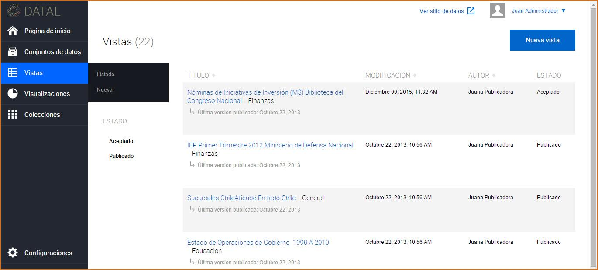

Ingrese a la sección Vistas

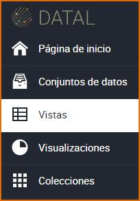

Presione el botón Nueva vista

Seleccione el Conjunto de Datos del cual desea crear una vista

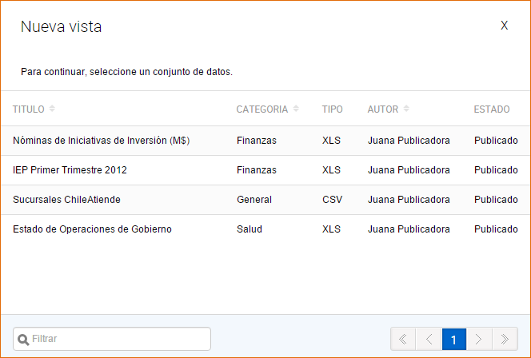

El sistema visualiza los datos para la creación de la Vista. En un mismo Conjunto de Datos pueden existir una o más tablas en una misma hoja, los que se muestran una bajo la otra, haga clic sobre una tabla de datos y presione el botón Continuar.

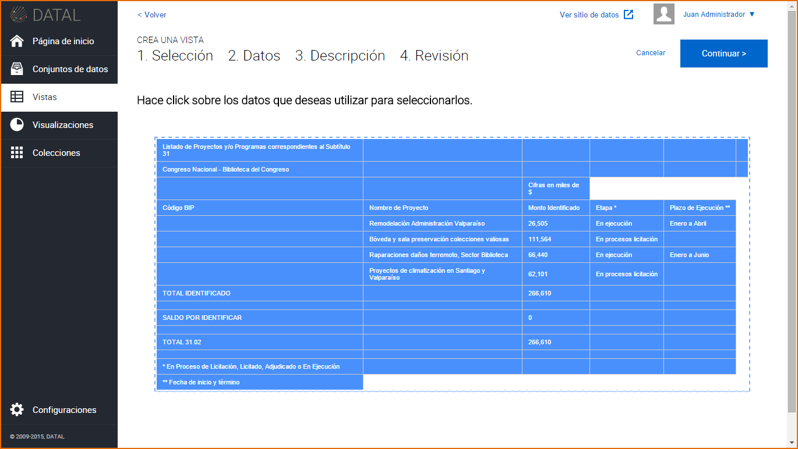

Luego precise que datos serán incluidos en la creación de la Vista.

Puede seleccionar todas las filas y columnas presionando |image21| o si lo desea solo algunas filas y columnas haciendo clic sobre ellas.

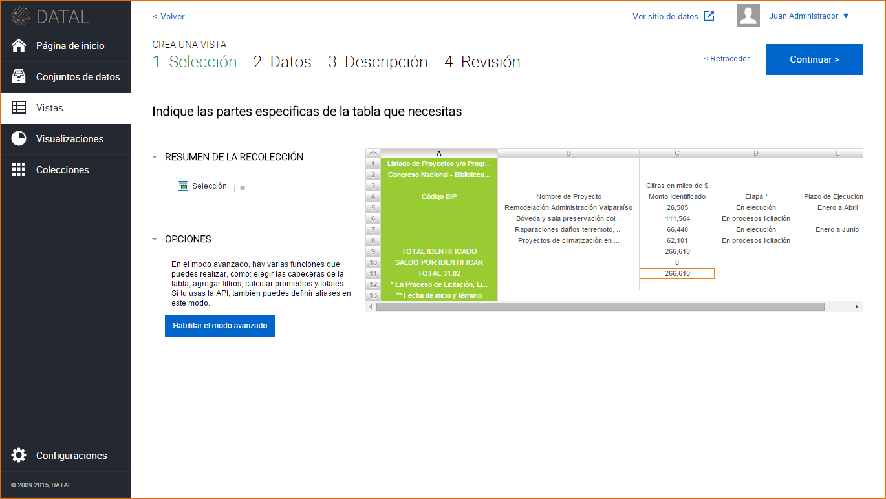

Una vez seleccionados los datos tiene la opción de activar el Modo Avanzado, para ello haga clic en el botón Habilitar Modo Avanzado:

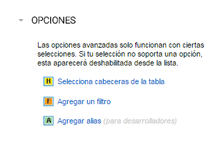

+ Selecciona cabeceras de la tabla, elija las filas que quiera dejar como cabecera y luego haga clic en Listo.
+ Agregar un filtro, seleccione un valor para la búsqueda e ingrese parámetros, luego haga clic en Listo. De manera automática se reducirá el tamaño de la tabla para mostrar solamente los valores ingresados como parámetro dentro del filtro.
+ Agregar Alias, esta funcionalidad es de interés exclusivamente para los desarrolladores. Su objetivo es permitir a los usuarios dar aliases a las columnas de una Vista, con el beneficio de que esto les permita identificarlas más fácilmente a la hora de procesarlas a través de nuestra API .Seleccione la opción Alias, luego sobre cada columna aparecen cajas de texto, ingrese el nombre y haga clic en Listo.

Hay dos importantes opciones para los filtros:

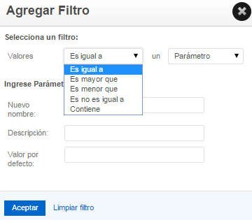

1.- Valores:

+ Es igual a:Ingrese un valor que sea exactamente lo que aparece en la columna seleccionada.
+ Es mayor que & Es menorque:Ingrese valores numéricos, permite retornar valores más altos o más bajos que su consulta.
+ No es igual a:Ingrese un valor que desea que se excluya de la consulta.
+ Contiene:Ingrese un valor que sea similar a lo que aparece en la columna.

2.- Seleccionar:

+ Parámetro: Permite tener un cuadro de texto para que ingrese consultas.
+ Valor fijo: Es un parámetro específico para la consulta.

Seleccionado los datos y personalizado con el Modo Avanzado, presione el botón Continuar.

El sistema visualiza la siguiente pantalla, complete los campos requeridos (*), pudiendo omitirse los siguientes: Fuentes, Etiquetas y Notas de la Vista. Luego de completar los campos requeridos, presione el botón Continuar y luego el botón Guardar. La Vista se crea por defecto en estado Borrador.

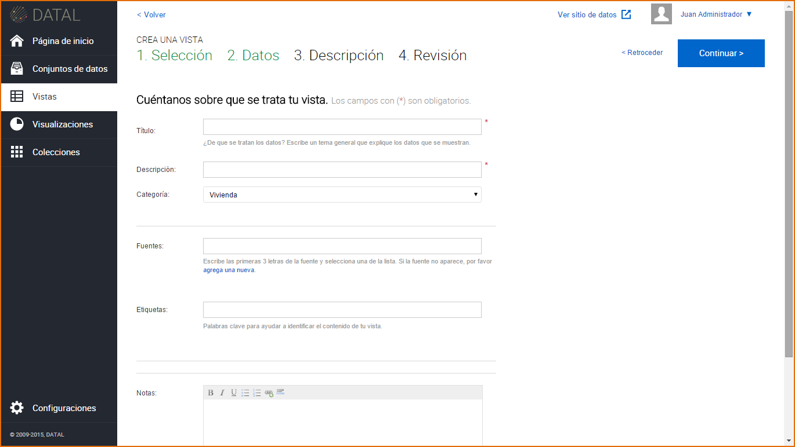

El sistema visualiza la Vista previa antes de guardar.

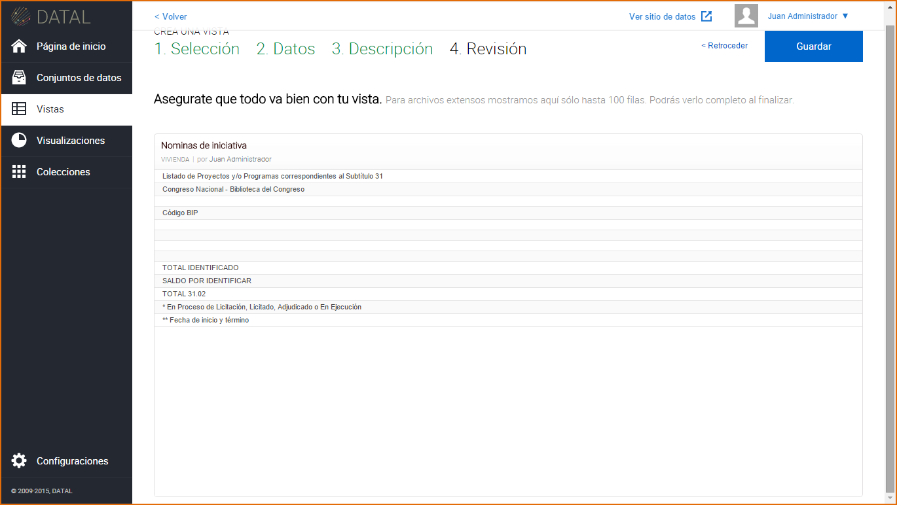

También puede crear una Vista editando un Conjunto de Datos, vaya a la sección Conjuntos de datos, haga clic sobre un Conjunto de Datos y presione el botón Crear Vista.

5.1 Edición de una Vista
------------------------
Una vez creada la Vista, se visualiza la misma en un listado, este listado cuenta con una paginación al igual que el listado de Conjuntos de Datos. Para esto se dirige a la sección Vistas

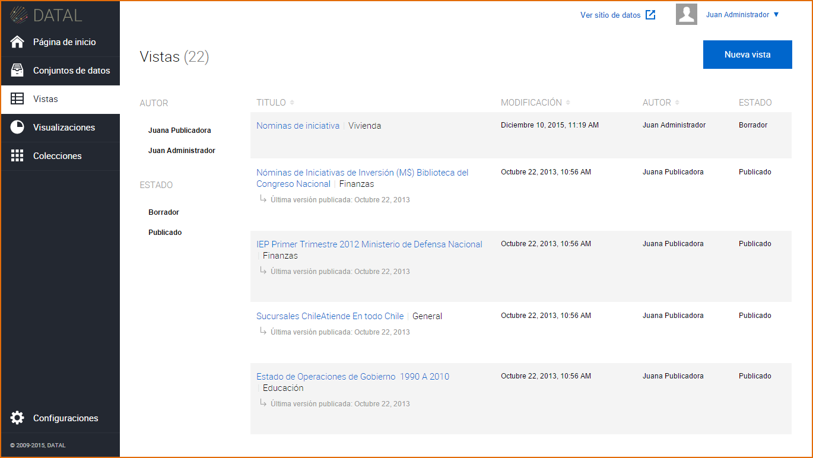

Para Editar una Vista, hay dos opciones:

+ Clic sobre la Vista: El sistema visualiza la información de la Vista
  seleccionada, presione |image28| e introduzca los cambios sobre la información
  de la Vista.

  .. image:: ../_static/images/image00.png

+ Acercar el mouse sobre la Vista: Se visualiza las siguientes
  opciones:

  .. image:: ../_static/images/image01.png

  + Crear Visualización: Al hacer clic sobre este botón puede crear una nueva Visualización tomando como referencia la Vista seleccionada.
  + Editar: Al hacer clic sobre este botón puede realizar cambios a la información de la Vista.
  + Borrar:Al hacer clic sobre este botón puede borrar los cambios recientes de la Vista o todos los cambios de la Vista.
  + Ver conjunto de datos:Al hacer clic sobre este botón puede acceder al Conjunto de Datos asociado.

Cuando la Vista se encuentra En revisión:

+ Los usuarios con rol Editores pueden enviar la Vista a Revisión, la
  Vista en este estado no puede ser editado, su opción de Editar solo es
  posible cuando el recurso es Aprobado o Rechazado.

  .. image:: ../_static/images/image02.png
  .. image:: ../_static/images/image03.png

+ Los usuarios con rol Publicadores o Administradores podrán Aceptar o
  Rechazar ese recurso.

  .. image:: ../_static/images/image04.png

5.2 Publicación de una Vista
----------------------------

Para publicar una Vista, el Conjunto de Datos asociado debe estar
previamente Publicado. En el caso que la Vista este en Revisión, esta
deberá ser Aceptada para luego ser Publicada, haga clic sobre el botón
Publicar.

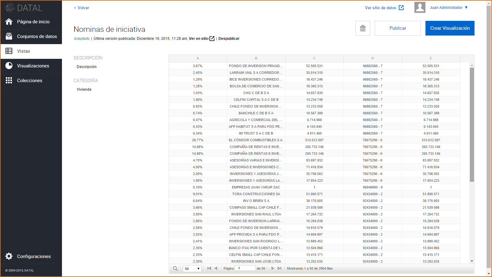

Para acceder al micrositio y visualizar la Vista publicada |image06|, haga clic sobre |image07|, margen superior derecho de la visualización de la Vista.

|image08|

5.3 Eliminación de una Vista
----------------------------

Para eliminar una Vista, hay dos opciones:

+ Dentro de la Vista, clic sobre |image09|
+ En el listado de Vistas, seleccione una Vista y presione el botón |image41|

  .. image:: ../_static/images/image42.png
  .. image:: ../_static/images/image43.png

El sistema permite eliminar la revisión actual de la Vista o todas las revisiones de la Vista. Esta última acción elimina la Vista y todos sus recursos asociados, como así también los elimina del micrositio.
Por revisión se entiende los distintos cambios realizados sobre la información de la Vista.

|image44|

Si la Vista se encuentra con estado En Revisión, no podrá ser eliminada del sistema.

|image45|

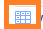
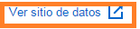
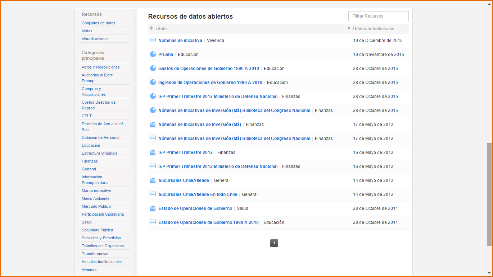

.. |image21| image:: ../_static/images/image21.png

.. |image41| image:: ../_static/images/image41.png
.. |image44| image:: ../_static/images/image44.png
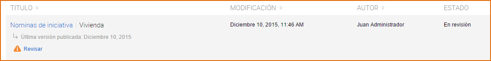