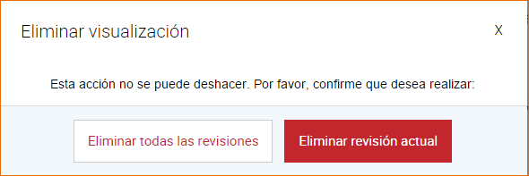

6. Creación de una Visualización
================================
Acceso directo desde:

Posicionarse sobre el botón Visualizaciones

Seleccione la opción Nueva

|image103|

Otra opción para poder acceder es:

Ingrese a la sección Visualizaciones

|image46|

Presione el botón Nueva visualización

Seleccione la Vista del cual desea crear una Visualización

|image47|

El sistema muestra la siguiente pantalla con los tipos de gráficos para la creación de una Visualización. Haga clic sobre el tipo Gráficos o Mapas y luego seleccione un gráfico específico, estos pueden ser:

+ Gráfico: De Línea, De Barras, De Área, De Columna y De Torta.
+ Mapas: Marcadores y Trazados.

.. image:: ../_static/images/image48.png
.. image:: ../_static/images/image49.png
.. image:: ../_static/images/image50.png

Una vez seleccionado el tipo de gráfico, el sistema muestra la siguiente pantalla según sea Gráficos o Mapas.

.. image:: ../_static/images/image40.png
.. image:: ../_static/images/image31.png

Haga clic sobre el botón |image32|, luego seleccione los datos (columnas) de la tabla de datos, estos son:

+ Gráficos: Intervalos con datos (eje Y), etiquetas (eje X) y encabezado o nombre del gráfico.

  .. image:: ../_static/images/image33.png

+ Mapas Marcadores: Latitud, Longitud e información de Marcadores, los marcadores son los nombres de los distintos puntos graficado en el
  mapa.

  .. image:: ../_static/images/image34.png

+ Mapas Trazados : Información de Trazado e información de marcadores

  .. image:: ../_static/images/image35.png

Una vez seleccionados los datos de la tabla, presione el botón Graficar.

El sistema muestra el gráfico con los datos seleccionados de la tabla de datos. Puede cambiar de gráfico haciendo clic sobre los diferentes tipos de gráficos que se muestran en el margen izquierdo de la pantalla.

.. image:: ../_static/images/image36.png
.. image:: ../_static/images/image37.png
.. image:: ../_static/images/image38.png

Creado el gráfico, presione el botón Continuar.

El sistema muestra la siguiente pantalla, complete los campos requeridos (*), pudiendo omitirse el campo Notas. Luego de completar los campos requeridos, presione el botón Continuar y luego el botón Terminar. La Visualización se crea por defecto en estado Borrador.

.. image:: ../_static/images/image39.png

El sistema muestra el gráfico con la información del mismo.

.. image:: ../_static/images/image29.png
.. image:: ../_static/images/image30.png

También puede crear una Visualización editando una Vista, vaya a la sección de Vista, haga clic sobre una Vista y presione el botón Crear Visualización.

6.1 Edición de una Visualización
--------------------------------
Antes de Guardar la Visualización o sea antes de presionar el botón Guardar, puede editar el gráfico presionando el botón |image61|, esta acción le permite seleccionar nuevamente los datos a graficar. También puede editar la información de la Visualización presionado el |image61| ubicado el margen izquierdo de la pantalla.

.. image:: ../_static/images/image62.png

Una vez creada la Visualización, se muestra la misma en un listado, este listado cuenta con una paginación, es decir que se puede ir avanzando página por página dentro del listado. Para esto se dirige a la sección Visualizaciones

.. image:: ../_static/images/image63.png

Para editar una Visualización, hay dos opciones:

+ Clic sobre la Visualización:El sistema muestra el gráfico más la información del mismo: Título del gráfico, Estado, Fecha de Creación, Descripción, Categoría y Nota, presione |image28| , e introduzca los cambios sobre la información como así también sobre el contenido de la Visualización.

  .. image:: ../_static/images/image56.png

+ Acercar el mouse sobre la Visualización: Se muestra las siguientes opciones:

  .. image:: ../_static/images/image57.png

  + Editar: Al hacer clic sobre este botón puede realizar cambios a la información de la Visualización.
  + Borrar:Al hacer clic sobre este botón puede borrar los cambios recientes de la Visualización o todos los cambios de la Visualización.
  + Ver vista:Al hacer clic sobre este botón puede acceder a la Vista asociada.

Cuando la Visualización se encuentra En revisión:

+ Los usuarios con rol Editores pueden enviar la Visualización a Revisión, la Visualización en este estado no puede ser editado, su opción de Editar solo es posible cuando el recurso es Aceptado o Rechazado.
+ Los usuarios con rol Publicadores o Administradores podrán Aceptar o Rechazar el recurso para luego publicarlo.

.. image:: ../_static/images/image64.png

6.2 Publicación de una Visualización
------------------------------------
Para publicar una Visualización, la Vista y el Conjunto de Datos asociados deben estar previamente Publicado. En el caso que la Visualización esté en Revisión, esta deberá ser Aceptada para posteriormente ser Publicada, haga clic sobre el botón Publicar.

.. image:: ../_static/images/image56.png
.. image:: ../_static/images/image59.png

Para acceder al micrositio y ver la Visualización publicada |image60|, haga clic sobre |image07| , en el margen superior derecho.

.. image:: ../_static/images/image55.png

6.3 Eliminación de una Visualización
------------------------------------
Para eliminar una Visualización, hay dos opciones:

+ Dentro de la Visualización, clic sobre |image09|

+ En el listado de Visualizaciones, seleccione una Visualización y presione el Botón |image41|

.. image:: ../_static/images/image56.png
.. image:: ../_static/images/image57.png

El sistema permite eliminar la revisión actual de la Visualización o todas las revisiones de la Visualización. Esta última acción elimina la Visualización, como así también lo elimina del micrositio. Por revisión se entiende los distintos cambios realizados sobre la información de la Visualización.

Si la Visualización se encuentra con estado En Revisión, no podrá ser eliminada del sistema.

.. image:: ../_static/images/image51.png

.. |image07| image:: ../_static/images/image07.png
.. |image09| image:: ../_static/images/image09.png
.. |image28| image:: ../_static/images/image28.png
.. |image32| image:: ../_static/images/image32.png
.. |image41| image:: ../_static/images/image41.png
.. |image46| image:: ../_static/images/image46.png
.. |image47| image:: ../_static/images/image47.png
.. |image60| image:: ../_static/images/image60.png
.. |image61| image:: ../_static/images/image61.png
.. |image103| image:: ../_static/images/image103.png