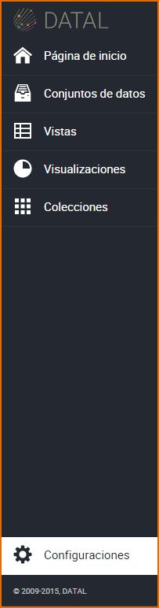
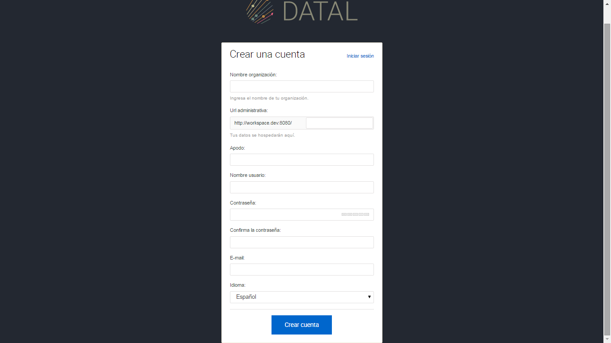
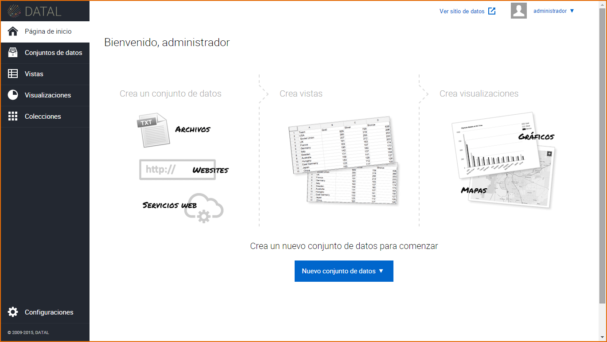

8. Creación y Configuración de una Cuenta
=========================================

Ingrese a la sección Configuraciones

El sistema visualiza en la pantalla las siguientes pestañas:

+ Información de la Cuenta:En esta pestaña están La Información de cuenta contiene el nombre de la organización y la dirección del sitio web de la misma y es visible a todo aquel que visite el Micrositio. La Información Contacto en cambio sólo está disponible para el Equipo Junar, contiene el nombre de la contraparte de Junar, correo electrónico, teléfonos y país. Luego de completados los campos requeridos (*), presione el botón Guardar.

  .. image:: ../_static/images/image53.png

+ Usuarios:En esta pestaña se puede modificar los roles de los usuarios, eliminarlos y crear nuevos, haga clic en Agregar un Usuario, esta acción nos permite agregar un nuevo usuario a la cuenta, complete los siguientes campos: Nombre, Usuario, Email, Confirmación de email y seleccione el tipo de rol, luego presione el botón Guardar. A través del correo electrónico se envía de forma automática un email a la persona y se manda un enlace para que la persona active su contraseña.

  .. image:: ../_static/images/image54.png

+ Branding (Apariencia):En esta pestaña se puede personalizar la apariencia del sitio de datos, podemos agregar título, url de la cabecera, url del pie, logo, icono de la página web, personalizar la visualización del título, encabezado, botones y color de fondo. Luego de personalizado el sitio de datos, presione el botón Guardar.

  .. image:: ../_static/images/image84.png

+ Social:En está pestañas se puede habilitar varias opciones en el sitio de datos, tales como: Habilitar acciones en vista incrustable, Habilitar para compartir en redes sociales, Habilitar notas, Habilitar descargas. Una vez configurados, presione el botón Guardar.

  .. image:: ../_static/images/image86.png

+ Preferencias del Dominio:En esta pestaña podemos configurar la URL central, para esto existen dos opciones: Poner un dominio propio albergado por la empresa o institución, en cuyo caso tienen que configurar un registro CNAME en el servidor DNS apuntando a `cloud.junar.com`_o usar un dominio gratuito provisto por Junar (del tipo `_ciudad_.opendata.junar.com`). Luego de completar los campos, presione el botón Guardar.

  .. image:: ../_static/images/image89.png

+ Categorías:En esta pestaña se puede crear una nueva categoría para nuestros recursos, en un inicio tiene una categoría por defecto la cual puede ser modificada, presione el botón Crear categoría, complete el campo: Nombre y si lo requiere el campo Descripción, luego presione el botón Guardar. También permite editar y borrar una categoría. En el caso que haya recursos creados con la categoría que borro, estos recursos migrarán a la categoría que se haya determinado por defecto.

  .. image:: ../_static/images/image91.png

+ Página de Inicio:En esta pestaña se puede diseñar la página de inicio del sitio de datos, las opciones pueden ser: Sin página de inicio, Clásico, Minimalista, Recursos, Carrusel, Portada, Coloreable, Carrousel y Botones. También podemos agregar contenido al sitio de datos, tales como Título de bienvenida, quienes somos, seleccionar recursos que se incluirán en el Carrousel, seleccionar enlace rápidos y mostrar u ocultar el catálogo de recursos en el sitio de datos. Luego de completar los campos, presione Vista previa antes de Guardar.

  .. image:: ../_static/images/image93.png

+ Creación de Nueva Cuenta de Usuario: Para crear una nueva cuenta de usuario, haga clic sobre Crear una cuenta.

  .. image:: ../_static/images/image80.png

El sistema muestra la siguiente pantalla, complete los siguientes campos: Nombre de la Organización, url administrativa, Apodo usuario, Nombre usuario, Contraseña, Confirmación de contraseña, email y seleccione el idioma. Luego de completar todos los campos presione el botón Crear cuenta.

Una vez creada la cuenta, la plataforma lo re direccionará a su nuevo Área de Trabajo, donde podrá manejar el proceso completo de apertura de datos desde la carga de Conjuntos de Datos desde múltiples fuentes y formatos, la creación de vistas y gráficos y la publicación de los mismos en un sitio personalizado de datos abiertos. En todo momento los usuarios tendrán la capacidad, a través de un sistema de permisos basado en roles, de gestionar tanto el proceso de creación, aprobación y publicación de los recursos como la apariencia del sitio de datos abiertos.

